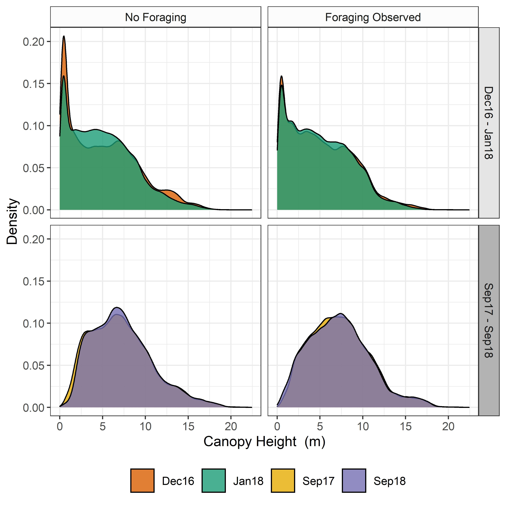

# Beaver Impacts on Riparian Vegetation Structure

This workflow details the analysis of canopy height data, derived from drone-based SFM surveys.

1. Compare the relative areas of loss and gain in canopy height between the foraged and non-foraged zones across the two time periods:

 

2. Compare the relative rates of change in canopy height between zones and across time periods.

3. Now let's run some regression analysis on the subsets of change rates - i.e. is there a significant difference between rates of canopy increase, decrease and net change between foraged and non-foraged zones across each time period?

4. So looks like there is significant change that can be attributed to beaver foraging but the effect of this change is only sizeable in the areas of loss. Not surprising here but shows that beaver foraging does have an impact on the mean rates of loss within riparian woodland and this has an overall impact on the net rates of change within the woodland.

5. Okay that's interesting but not all that surprising... So what does this mean in terms of total canopy structure? Well let's compare the density distri ution of canopy heights at the start of beaver introduction and at the latest survey point...

6. Right, so it looks like the difference in canopy height vetween the two time peridos is neglibile in both winter and summer survey periods. However,there is an interesting observation - In summer there is an increase in the elevation of mid sized trees - unsurprising really, trees grow. However, this isn't reflected in the Winter monitoring perio - my guess is that this is due to the worse reconstruction of canopy heights during the winter.... Let's do some stats and find out what's happening.If we see a significant interaction between time period and foraging we can deduce that beavers have had a significant effect on canopy structure....

7. Yes, it seems that beaver foraging does significantly effect canopy structure (but only very slightly) relative to unforaged areas. However, this change is only detectable in Winter - perhaps an artefact of the survey method? Let's chaeck out the marginal means to better contextualise the resutls of the regression...

Right so we can see that there is loss ion both regions during winter - this is why we need to consider the interaction effect! But in the summer there is an increase in the mean height of the canopy in non-foraged areas but a decline in mean height in foraged regions. This perhaps indicates that, in temperate landscapes, beaver may actually help to maintain lower height "shrubby" riparian woodland structure. Additionally, if we refer back the boplot figure, we can see that the variance in the rates of change, particularly where loss is concerned, is much greater where beavers are foraging. This suggests that beaver foraging is likely to increase the variability in cnopy height relative to non-foraged riaprian woodland.

